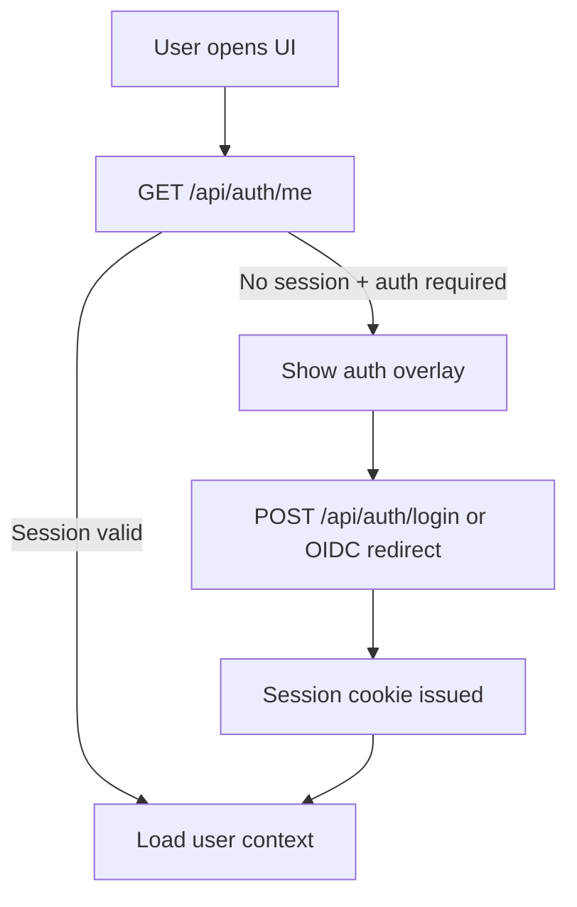
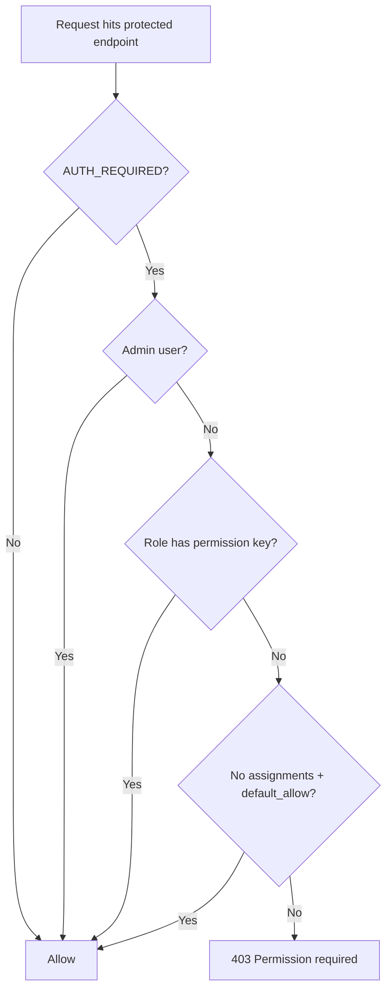
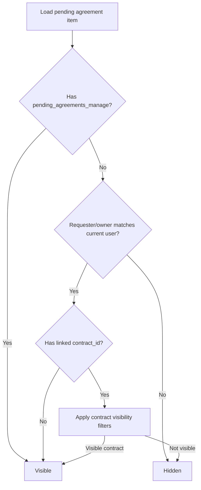

# Functional Specification: Permissions, Access Layout, and Process Flows

## 1) Purpose
Define the current-state permission model, interface layout, and process flows for Contract OCR so stakeholders can:
- understand what is implemented now,
- identify where behavior is implicit or inconsistent,
- prioritize follow-on development for a more complete, auditable authorization model.

---

## 2) Scope
This specification covers:
- authentication entry points (local + OIDC),
- role and permission assignment,
- permission enforcement in API flows,
- visibility constraints for contracts/pending agreements,
- admin permission-management UX layout,
- gap analysis and development backlog.

Out of scope:
- full identity lifecycle automation (SCIM/JIT deprovisioning),
- enterprise policy engine integration (OPA/Cedar),
- external SIEM integrations.

---

## 3) Current-State Functional Model (As-Is)

### 3.1 Actors
- **Anonymous user**: no valid session.
- **Authenticated user**: has session and at least one account record.
- **Admin user**: authenticated user with `admin` role (or `is_admin` compatibility checks in some paths).
- **Role-managed user**: user receiving permissions through `auth_user_roles` + `role_permissions`.

### 3.2 Permission primitives (implemented)
The system uses a permission matrix with explicit keys:
- `pending_agreements_view`
- `pending_agreements_manage`
- `pending_agreement_reminders_manage`
- `tasks_view`
- `tasks_manage`
- `user_directory_view`
- `user_directory_manage`

Each permission has metadata including label, description, and `default_allow` behavior.

### 3.3 Default behavior (implemented)
- If `AUTH_REQUIRED=false`, all permission checks effectively allow.
- Admin users always pass permission checks.
- If a permission has no explicit role assignment and `default_allow=true`, access is granted to non-admin users.
- `pending_agreements_view` is auto-added to authenticated users in `/api/permissions/me` response, even when unassigned.

### 3.4 Data structures (implemented)
- Users, roles, and membership:
  - `auth_users`, `auth_roles`, `auth_user_roles`.
- Session persistence:
  - `auth_sessions`.
- Permission assignment:
  - `role_permissions(permission_key, role_id)`.
- Tag-scoped role visibility:
  - `tag_roles(tag_id, role_id)`.

### 3.5 API management surfaces (implemented)
Admin-only management endpoints:
- permission matrix read/update:
  - `GET /api/permissions`
  - `PUT /api/permissions/{permission_key}`
- tag role restrictions:
  - `GET /api/tag-permissions`
  - `PUT /api/tag-permissions/{tag_id}`

User-level permission introspection:
- `GET /api/permissions/me`

### 3.6 Access control behavior in domain flows (implemented)
- **Pending agreements**
  - Full manage access if user has `pending_agreements_manage`.
  - Non-managers can only see their own submissions (email/name match checks) and only where contract visibility permits.
- **Pending agreement reminders**
  - Requires `pending_agreement_reminders_manage` for create/update/delete.
- **Tasks**
  - Requires `tasks_view` for listing.
  - Requires `tasks_manage` for mutating operations.
- **User directory**
  - `user_directory_view` and `user_directory_manage` gate read/write paths respectively.

### 3.7 UI layout (implemented)
Current UI includes:
- auth overlay and login/logout controls,
- OIDC login button when enabled,
- admin-governed sections where permission matrix and role assignments are loaded,
- client-side helper `hasPermission(permissionKey)` for conditional rendering.

---

## 4) Current Layout Specification (As-Is UI/IA)

### 4.1 Admin permissions area
Recommended representation of current behavior:

1. **Permissions Matrix Panel**
   - Rows = permission keys.
   - Columns = roles.
   - Cell = checkbox for role assignment.
   - Save action triggers `PUT /api/permissions/{permission_key}`.

2. **Tag Access Panel**
   - Rows = tags.
   - Multi-select roles assigned to each tag.
   - Save action triggers `PUT /api/tag-permissions/{tag_id}`.

3. **Role Management Panel**
   - Create/update/delete roles.
   - Used as source of role options for both panels above.

### 4.2 End-user layout implications
- Features should appear only when user has the required permission.
- Pending agreements queue for non-managers should present “My requests” behavior by default.
- Actions that may 403 should be visually disabled when possible to reduce confusion.

---

## 5) Process Flows (Current)

### 5.1 Authentication and session flow

### 5.2 Permission evaluation flow (server)

### 5.3 Pending agreement visibility flow (non-admin)

---

## 6) Known Gaps and Further Development Work (To-Be)

### 6.1 Functional gaps
1. **Permission coverage map is incomplete**
   - Not all business capabilities are represented by dedicated permission keys.
2. **Mixed role semantics (`admin` role vs compatibility flags)**
   - Some paths still infer admin through legacy-compatible fields.
3. **Implicit grants create explainability gaps**
   - `default_allow` and auto-added `pending_agreements_view` can confuse auditors.
4. **No policy versioning / change history for permission assignments**
   - Assignment changes are not first-class auditable objects.
5. **No simulation endpoint (“why allowed/denied?”)**
   - Troubleshooting requires code/database inspection.
6. **Potential UI/API mismatch risk**
   - Client-side hiding is advisory; server is authoritative, but user feedback can be unclear.

### 6.2 Non-functional gaps
- No explicit permission decision logs for denied access attempts.
- No SLA/latency targets for permission-heavy listings.
- No deterministic authorization test matrix in CI.

---

## 7) Target-State Enhancements

### 7.1 Authorization product requirements
1. **Capability inventory**
   - Catalog every action (read/write/approve/export/admin).
2. **One action → one required permission (or documented composite)**
   - Eliminate undocumented implicit access paths.
3. **Deterministic explainability**
   - Add API to return effective permissions + rationale.
4. **Auditable policy operations**
   - Log permission assignment changes with actor, delta, timestamp.
5. **Safe defaults**
   - New permissions default deny unless explicitly approved.

### 7.2 Proposed new endpoints
- `GET /api/permissions/effective?user_id=...`
- `POST /api/permissions/simulate` (input: user, action, resource)
- `GET /api/permissions/audit-log`

### 7.3 Proposed UI layout upgrades
1. **Permissions Overview Dashboard**
   - Cards for high-risk permissions and assignment counts.
2. **Matrix with inheritance/explainability column**
   - Show whether allow is role-based, default, or admin override.
3. **What-if simulator panel**
   - Pick user + action + object and show allow/deny + reason.
4. **Policy changes timeline**
   - Chronological stream of grants/revokes.

---

## 8) Development Roadmap

### Phase 1 (Hardening)
- Build permission-to-endpoint/action catalog.
- Remove undocumented implicit grants or document them in API.
- Add integration tests for all existing permission keys.

### Phase 2 (Explainability + Audit)
- Implement effective permission and simulation endpoints.
- Persist policy change logs.
- Add denial reason payload standards for 403 responses.

### Phase 3 (Governance UX)
- Ship dashboard + simulator + timeline views.
- Add role templates (Legal Reviewer, Requester, Task Operator).
- Add exportable access review reports.

---

## 9) Acceptance Criteria

### Current-state documentation acceptance
- All implemented permission keys and their defaults are documented.
- All currently enforced process flows are diagrammed.
- All known gaps are mapped to backlog items.

### Future implementation acceptance (for next development cycle)
- 100% of mutating endpoints mapped to explicit permissions.
- Automated tests verify allow/deny outcomes per role template.
- Admin can retrieve “why denied” details for a user-action-resource tuple.

---

## 10) Open Questions
1. Should `pending_agreements_view` remain implicitly granted to all authenticated users?
2. Should `tasks_manage` continue as `default_allow=true` in regulated environments?
3. Should contract visibility and permission checks be unified into a single policy decision object?
4. What retention period is required for permission assignment audit logs?

---

## 11) Implementation Notes for Next Sprint
- Start with a machine-readable permission registry (JSON/YAML) that drives both backend checks and frontend labels.
- Add contract tests that compare declared registry against enforced endpoints.
- Introduce a thin authorization service module to centralize decisions and rationale text.
